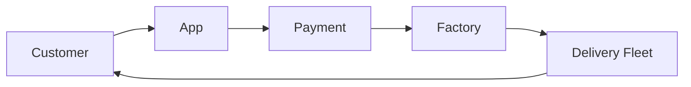

# x)

## Threat modelling

### Braiterman et al 2020: Threat modeling manifesto

- Gives you general information on why you should threat model
- Threat modelling values things such as the journey of understanding, and refinement
- Some principles of threat modelling include early and frequent analysis of the security and privacy of a system, and that threat modelling should align with the principles of the organization that is being protected.

### Shostack 2022 

- Adam Shostack teaches an introduction to threat modelling
- We should threat model to anticipate problems when it is easiest to deal with them. Before even the start.
- What are we working on? What can go wrong? What are we going to do about it? Did we do a good job?
- Collaboration is important
- Sketch your ideas so other people can engage with them
- Keep records on what you have done to threat model
- 
  1. External entities have sharp corners as they are out of our control
  2. Processes like any code that is under your control,
  3. data flows to connect 1 and 2,
  4. Drums to represent where data is stored,
  5. trust boundary to show where different elements are operated by different processes or people.

- You should always ask what could go wrong
- STRIDE helps us realise what might be the problem we are facing.
- We always need to track our work.
- Risk modelling helps us make decisions on problems.
- You should ask the question of "Would you recommend threat modelling to a colleague?" as it really questions the participants if their work actually meant something

### OWASP CheatSheets Series Team 2021

- Provides a concise and actionable reference to people who are new or experienced in threat modelling.
- Threat modelling is a structured and repeatable process that is used to gain insight into certain security characteristics of a system.
- Threat modelling seeks to prevent problems early on.
- System modelling seeks you to answer the question of what you are actually building as if you dont know what you are doing it will be very hard to understand the threats that it could face
- Threat identification is the step after you model your system as it asks what could go wrong with the system you built. You should use the STRIDE model
- Response and mitigation wants you to think about what you are going to do about the problem with the META model. So mitigate, eliminate, transfer, and accept. You should think which response works with your threat the best.
- Review and validation asks you the question of "did we do a good enough job?". Your threat model needs to be review by shareholders to see if it actually is an adequate model.

## Infosec scene

For my infosec scene excercise I chose the episode 153: Bike Index.

- The episode interviews Bryan Hance who created a platform that helps people register and recover their stolen bicycles called StolenBicycleRegistry. He then met a guy called Seth Herr who was a bike mechanic from Chicago, who had a problem with
  bikes being stolen from his shop. So both of them together created the website bikeindex.org to help people find their stolen bikes.
- The episode really just goes on about Bryan telling stories on how he hates people who steal bikes.
- He also raises the concern that the police really dont help people a lot in recovering their bikes. They just say that register them in bikeindex.org and when bike index tells the police that they had found a thief the police ignore them.
- Bryan then tells about a large operation that was first found out through a facebook page called Constru-Bikes. Thousands of bikes were being stolen from a 100 mile radius of San Fransisco and were then transported to Mexico and sold there. This had been going
  on since 2015.
- Bike Index has recovered at the time of the recording about $27 million worth of bikes.

# a)

## Security hygiene

- One should always use strong passwords, update their software to the lastest version, think before you click a suspicious link, and use of multi-factor identification.
- All of the mentioned practices should be followed by individuals and organizations

# b)

## Make-belief boogie-man

My business is going to be e-commerce company that includes its own delivery system. 

### 1 What are we working on?

- Our key assets (crown jewels) are our customers personal information such as home addresses, phone numbers, bank or payment information. As well as our delivery system.
- The company uses an app so that our customers can easily order whatever they need
- We also have a system that controls the payment of the product
- We have a factory where the product is fetched from
- We have a delivery fleet to get the product to the customer

- We have an app that allows customers to easily buy straight from our factory.
- Customer touchpoint is our app and our delivery system

### 2 What can go wrong?

-  STRIDE
   - Tampering: Our delivery systems could be modified to make packages go to the wrong addresses.
   - Expected value is high because probabily is medium but the monetary value is very high if products get stolen
 
   - Information disclosure: Our customers personal information such as address and payment information could be leaked
   - Expected value is high because probability is high and monetary value is high because of the aftermath if we lose customers
 
- Some threat actors could be an insider who has access to sensitive information or systems
- TTPs include having systems to check for threats.

### 3 What are we going to do about it?

- Have customers and employees use multi-factor authentication
- Have software to check for potential threats in the system
- 

### 4 Did we do a good enough job?

- Have stockholders always approve of our threat protection systems before implementing.
- Review our threat modeal frequently.
- Constantly improve upon our security measures.
- Hire people to do penetration tests on our software.

# References

- Braiterman et al 2020: [Threat modeling manifesto](https://www.threatmodelingmanifesto.org/)
- Shostack 2022: [Welcome to the Worlds Shortest Threat Modeling Course ](https://www.youtube.com/playlist?list=PLCVhBqLDKoOOZqKt74QI4pbDUnXSQo0nf)
- OWASP CheatSheets Series Team 2021: [Threat Modeling Cheat Sheet](https://cheatsheetseries.owasp.org/cheatsheets/Threat_Modeling_Cheat_Sheet.html)
- Darknet Diaries 2025: [Episode 153: Bike Index](https://darknetdiaries.com/episode/153/)
- Cybersecurity & Infrastructure Security Agency n.d: [Cybersecurity Best practices](https://www.cisa.gov/topics/cybersecurity-best-practices)

